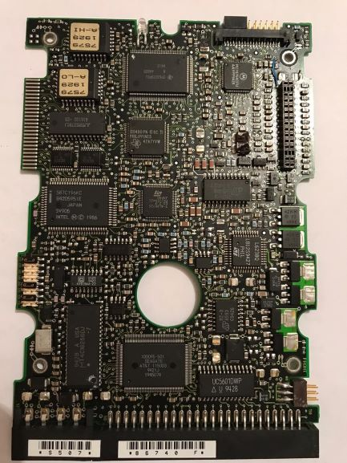

 
  در لغت به معنی درایو سخت افزاری می باشد
هارد یک حافظه دائمی است و به صورت دیجیتالی رمزنگاری شده 
و اطلاعات را روی سطح مغناطیسی دیسک های خود ذخیره می کند.  
 در این پست قصد داریم با بخش مهمی از هارد  تحت عنوان "مدار الکترونیکی" آشنا شویم:  
 از مهم ترین اجزاء هاردها برد آن می باشد که اصلی ترین وظایف را بر عهده دارد. برد هارد دیسک مانند بسیاری از بردهایی که تا کنون دیده اید از سر هم شدن تعدادی قطعه ی الکترونیکی بر روی یک یونیت سبز رنگ ایجاد شده است اما تفاوت چشم گیری با دیگر برد ها دارد.
  وظیفه ی کلی برد هارد دیسک ، کنترل هارد دیسک  و دریافت دستورات برای اجرا در سیستم می باشد. 

این قطعه ی کوچک وظایف گوناگونی از جمله بکار انداختن موتور هارد دیسک 
و خواندن اطلاعات از روی پلترها را بر عهده دارد همچنین برد هارد دیسک حاوی قسمت فریموری هارد می باشد تا هارد بتواند به درستی کار کند.
 درزمانی که برد هارددیسک هنوز در کارخانه می باشد این اطلاعات و برنامه ریزی بر روی برد الکترونیکی ریخته می شود تا انطباق های موثر ،
  دسترسی موفق به میکروکدها برای راه اندازی هارد و … را به صورت از پیش تعیین شده انجام دهد.  

در واقع به صورت کلی برد هارددیسک با توجه به برنامه ای از پیش تعیین شده در ابتدا دستورات را دریافت و سپس پس از تحلیل این دستورات آن را انجام می دهد،
 یعنی در کنار این که هارد وظیفه ی ذخیره سازی اطلاعات را انجام می دهد برد این دستورات را تحلیل می کند و دستور خواندن اطلاعات را در سیستم اجرا می کند.  

